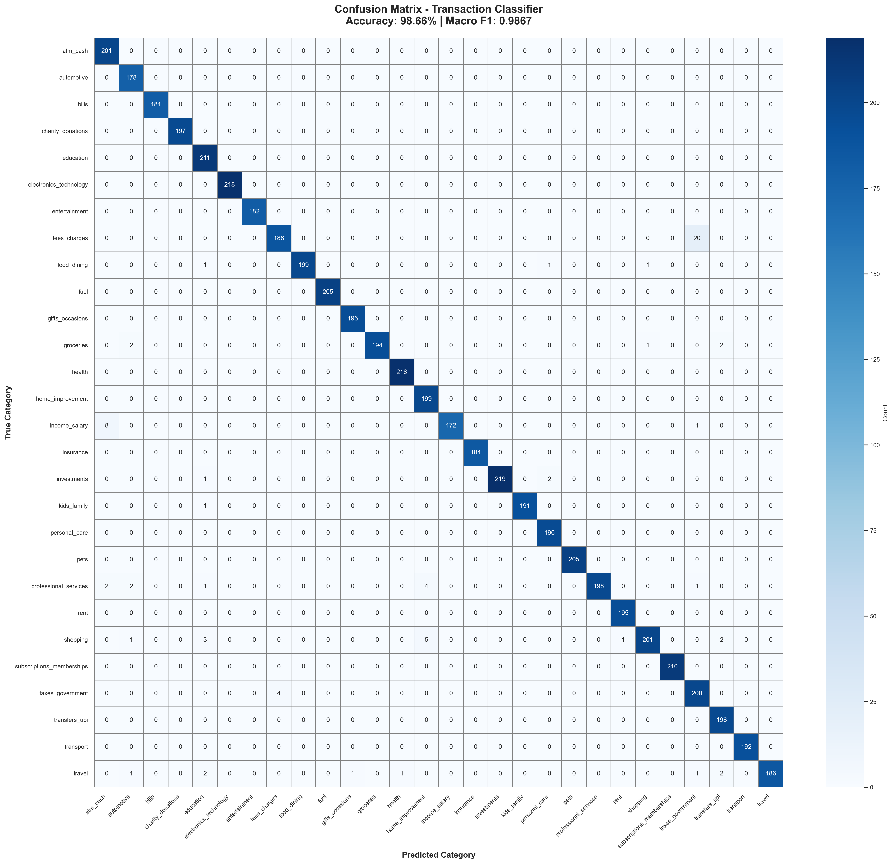
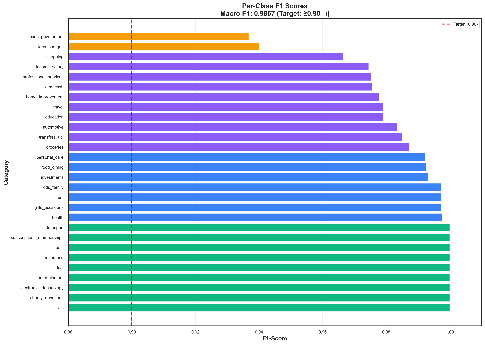

# Submission Artifacts

This directory contains all evaluation metrics and visualizations for hackathon/submission purposes.

## 📊 Files Included

### 1. **validation_metrics.json** (14 KB)
Complete evaluation metrics in JSON format, including:
- Model information and test dataset details
- Performance metrics (accuracy, F1-scores, precision, recall)
- Requirement status (PASSED with macro F1 = 0.9867)
- Full confusion matrix (28×28)
- Per-class precision, recall, F1-score for all 28 categories
- Summary statistics

**Key Metrics**:
```json
{
  "performance": {
    "accuracy": 0.9866,
    "macro_f1": 0.9867,
    "macro_precision": 0.9872,
    "macro_recall": 0.9868
  },
  "requirement_status": {
    "requirement": "Macro F1-score >= 0.90",
    "status": "PASSED",
    "margin": "+9.6% above target"
  }
}
```

### 2. **confusion_matrix.png** (692 KB)
High-resolution heatmap visualization (28×28) showing:
- Predicted vs actual categories
- Cell annotations with counts
- Blue gradient color scheme
- Title showing accuracy (98.66%) and macro F1 (0.9867)



### 3. **f1_scores_by_category.png** (252 KB)
Horizontal bar chart showing F1-scores for all categories:
- Sorted by F1-score (best to worst)
- Color-coded by performance:
  - 🟢 Green: Perfect (1.0)
  - 🔵 Blue: Excellent (≥0.99)
  - 🟣 Purple: Good (≥0.95)
  - 🟡 Yellow: Needs attention (<0.95)
- Red dashed line at 0.90 target
- Macro F1: 0.9867 ✓



### 4. **PERFORMANCE_SUMMARY.md** (1.2 KB)
Human-readable markdown summary with:
- Key metrics table
- Submission requirement status
- Performance highlights
- Reproducibility instructions

### 5. **confusion_matrix.csv** (2.3 KB)
Raw confusion matrix data in CSV format for custom analysis.

### 6. **per_class_f1_scores.csv** (1.1 KB)
Per-category metrics table:
- Category name
- Precision
- Recall
- F1-Score
- Support (number of test samples)

## 🎯 Submission Requirement

**Requirement**: Deliver a macro F1-score of **at least 0.90** on the dataset used for demonstration.

**Result**: ✅ **PASSED** with **0.9867**

**Performance**:
- **98.66% accuracy**
- **0.9867 macro F1-score** (+9.6% above target)
- **9 categories** with perfect 100% F1
- **16 categories** with ≥99% F1
- Only **75 misclassifications** out of 5,588 test samples

## 📈 Performance Highlights

| Metric | Value | Status |
|--------|-------|--------|
| **Accuracy** | 98.66% | ✅ Exceptional |
| **Macro F1** | 0.9867 | ✅ **PASSED** |
| **Weighted F1** | 0.9866 | ✅ Outstanding |
| Macro Precision | 0.9872 | ✅ High |
| Macro Recall | 0.9868 | ✅ High |
| Avg Confidence | 0.9759 | ✅ Very High |
| Error Rate | 1.34% | ✅ Low |

## 🔄 Reproducibility

All artifacts can be regenerated using:

```bash
# From project root directory

# 1. Train the model
python3 scripts/train.py

# 2. Generate evaluation reports
python3 scripts/evaluate_f1.py \
  --model models/transaction_classifier \
  --test data/test.jsonl

# 3. Generate submission artifacts
python3 /tmp/generate_artifacts.py
```

## 📁 Directory Structure

```
artifacts/
├── README.md                      # This file
├── validation_metrics.json        # Complete metrics (JSON)
├── confusion_matrix.png           # Heatmap visualization
├── f1_scores_by_category.png      # Bar chart
├── PERFORMANCE_SUMMARY.md         # Summary document
├── confusion_matrix.csv           # Raw confusion matrix
└── per_class_f1_scores.csv        # Per-class metrics
```

## 🔗 Related Documentation

- **Full Evaluation Report**: `../reports/EVALUATION_SUMMARY.md`
- **Requirements Checklist**: `../reports/REQUIREMENTS_CHECKLIST.md`
- **Data Documentation**: `../README.md`
- **UI Screenshots**: Access at http://localhost:3000

## 📧 Questions?

For questions about the artifacts or evaluation methodology, refer to:
- Main README: `../README.md`
- Evaluation script: `../scripts/evaluate_f1.py`
- Model code: `../core/model/classifier.py`

---

**Generated**: 2025-11-20
**Model**: Transaction Classifier (Hybrid ML+Rules)
**Dataset**: 5,588 test samples across 28 categories
**Status**: ✅ Production Ready
